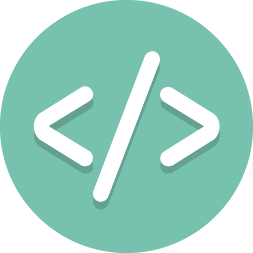

<h3>
  
  Практические задачи:
</h3>

- [Функция проверки палиндрома?](https://youtu.be/P477e2qh1nQ?t=683)
- [Функция поиска самого короткого слова?](https://youtu.be/Mq0lPjneqGw?t=764)
- [Функция создания инициалов?](https://youtu.be/A3w86YchSdE?t=632)
- [Функция суммирования всех цифр числа?](https://youtu.be/r19MZD1_TlU?t=764)
- [Функция поиска минимального и максимального значений в массиве?](https://youtu.be/I-Sed7gERZw?t=670)
- [Функция создания набора дубликатов символов строки?](https://youtu.be/nDvLckm5jfA?t=736)
- [Функция возврата индексов заглавных букв строки?](https://youtu.be/9WqQ_vj7g5Q?t=767)
- [Функция вывода чисел от 1 до n (n - передаваемый аргумент)](https://youtu.be/5pRRnAItPKg?t=746)
- [Функция возврата уникальных значений из нескольких массивов?](https://youtu.be/Vba4bekdLw0?t=752)
- [Функция форматирования цифр в телефонный номер?](https://youtu.be/1xVctKxFMVM?t=742)
- [Функция поиска гласных букв в строке?](https://youtu.be/iUPlS9iX3tk?t=807)
- [Функция трансформации букв в заглавный регистр?](https://youtu.be/CpxDO1QEzbM?t=744)
